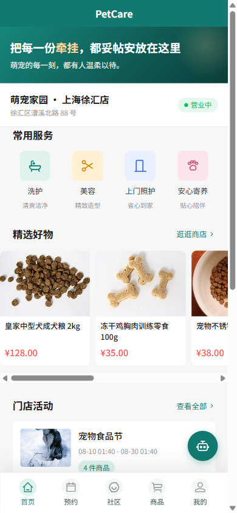
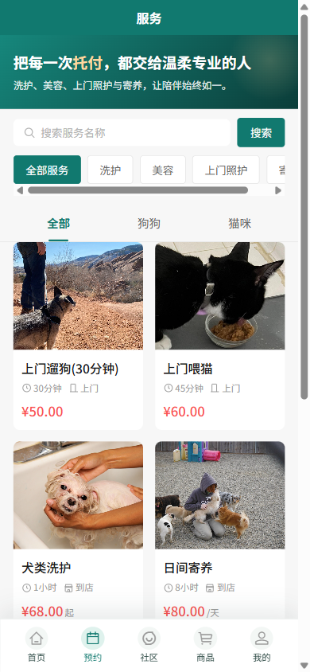
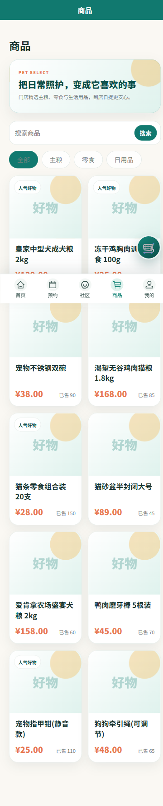
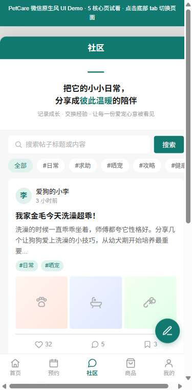
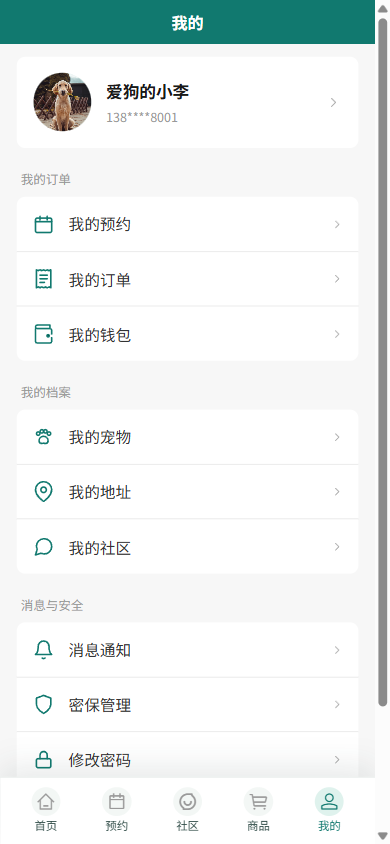
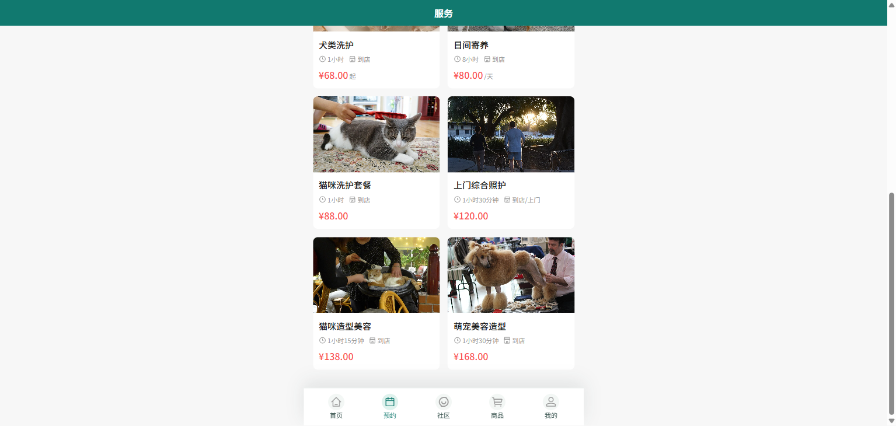
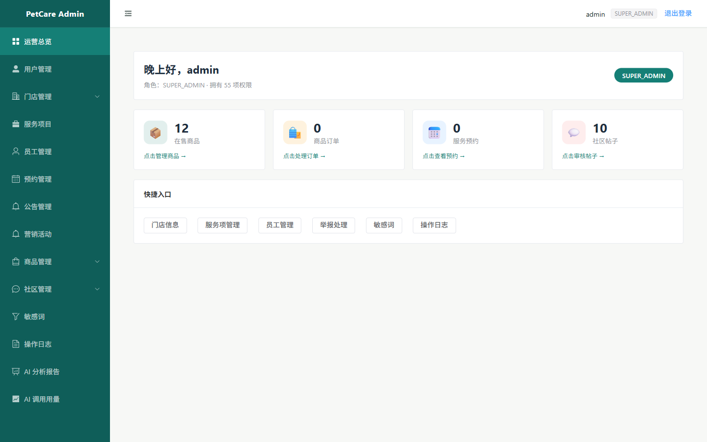
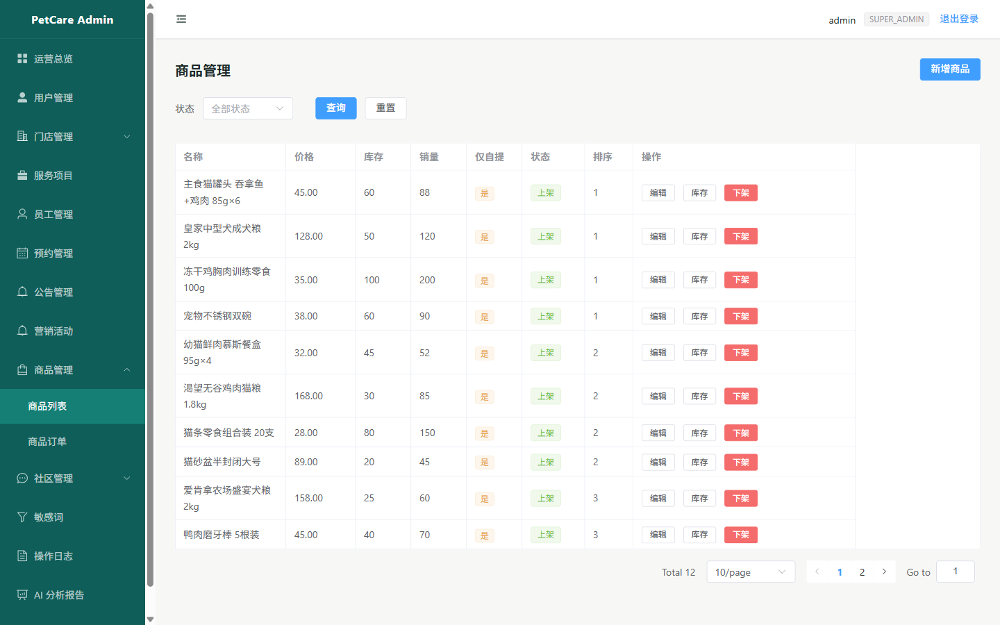
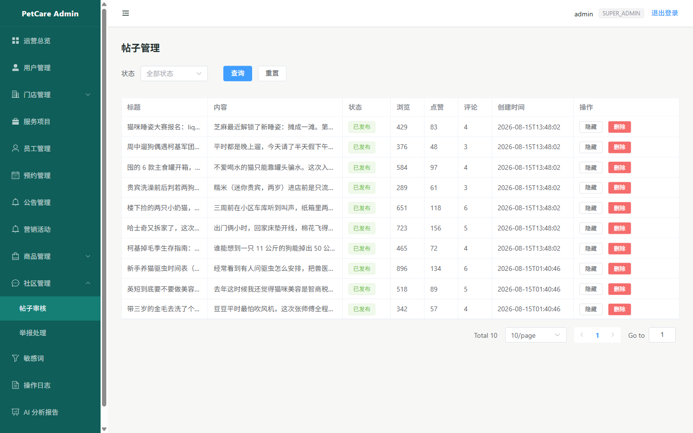
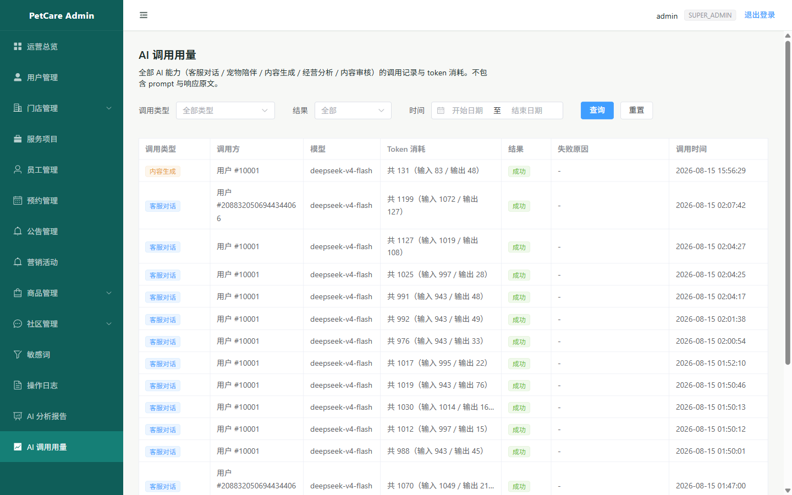

# PetCare O2O 🐾

**[简体中文](README.md) ｜ [English](README_EN.md)**

[](https://github.com/zengmo20224/PetCare/actions/workflows/ci.yml)

> **An O2O full-stack platform for single-location pet stores**: service booking · retail · community · wallet ledger · AI Agents — undergraduate capstone project
>
> **M1–M8 all delivered** ｜ AI Agents (RAG + restricted tool calls + SSE streaming) in production ｜ White-box security audit → fix → regression loop closed ｜ Docker one-command deploy + live VPS demo

---

## ✨ Five things worth seeing in this project

### 1. AI Agents engineered end-to-end, not an API wrapper

Three agents (customer-service / business-analytics / community-assistant) run on a single orchestration layer: intent recognition → PgVector RAG augmentation (HNSW vector index) → read-only tool whitelist calls (5 tools for support, 4 for analytics) → three-layer medical guardrails → SSE streaming responses. Embeddings run locally via ONNX (a small Chinese BGE model, 384 dims) — no external embedding API, zero extra cost. Every billable endpoint sits behind three-tier rate limiting (per-minute / per-user daily / global daily), and every call is audited by model / tokens / outcome (conversation content excluded).

### 2. Architecture boundaries enforced by tests, not goodwill

Three reflection-based architecture guard tests run in CI: `AiProviderArchitectureTest` / `AiAgentArchitectureTest` / `AiRagArchitectureTest` forbid AI code from depending on Mappers / DataSource / MyBatis, require every support tool to be `readOnly()`, and force business data access through whitelist tools → business services. PgVector stores derived knowledge only (rebuildable from MySQL at any time); MySQL remains the single source of truth. AI suggestions never mutate business data, and streamed output passes the same guardrails.

### 3. Concurrency & consistency verified on real MySQL, not mocks

Testcontainers spins up real MySQL / PgVector for integration tests (order idempotency under concurrency, no oversell, wallet-payment/inventory atomicity, booking slot races, illegal state transitions rejected) — see [Testing & quality](#-testing--quality) below.

### 4. A closed white-box security audit loop

Self-audit surfaced 2 high-severity findings (replayable order creation → oversell; zero rate limiting → credential brute force) plus 5 medium ones (missing upload magic-byte checks, user enumeration, stored XSS, a broken RBAC role model, a Spring CVE) — all fixed and regression-tested. The pre-launch hardening checklist is closed out (2 deploy-time items — production credentials / public domain — deferred to deployment). See the [security audit report](docs/11-security-audit-2026-07.md) (Chinese).

### 5. Engineering governance by the book

Configuration management per IEEE Std 828-2012 (76 registered config items, 8 baseline tags, 4 real change-request instances); Conventional Commits; a Jenkins 8-stage pipeline plus GitHub Actions with three parallel jobs; Docker Compose one-command deploy with health checks, deployed to a live VPS demo (Caddy + HTTPS).

---

## 📌 Overview

PetCare O2O is a modular monolith serving a single pet store: service booking, product retail, a wallet ledger, community engagement, marketing campaigns, and AI agents across six business domains. It ships responsive-H5-first — a web app that works on phones and desktop browsers — with a WeChat Mini Program demo running in parallel.

| Client | Stack | Entry |
|---|---|---|
| **Admin console (PC Web)** | Vue 3 + Vite + Element Plus | http://localhost:8080 |
| **Customer H5 / Mini Program** | UniApp + Vue 3 + wot-design-uni | http://localhost:8081 |
| **Backend API** | Spring Boot 3.3 + MyBatis-Plus + MySQL 8 + PgVector | http://localhost:8082 |
| **CI/CD** | Jenkins + GitHub Actions + Docker Compose | http://localhost:9090 |

---

## 📱 UI Showcase (2026-08 redesign, captured from the running app)

### Customer H5

> All five pages captured from the **live app** at a uniform 390×844 viewport, backed by the real API and a licensed demo media seed set (68 Wikimedia/Unsplash images, per-image credits in `uploads/images/seed/CREDITS.md`).

<table>
  <tr>
    <td align="center"></td>
    <td align="center"></td>
    <td align="center"></td>
    <td align="center"></td>
    <td align="center"></td>
  </tr>
  <tr>
    <td align="center"><sub><b>Home</b></sub></td>
    <td align="center"><sub><b>Service Booking</b></sub></td>
    <td align="center"><sub><b>Retail</b></sub></td>
    <td align="center"><sub><b>Community</b></sub></td>
    <td align="center"><sub><b>Profile</b></sub></td>
  </tr>
</table>

<p align="center">
  <br/>
  <sub><b>Desktop responsive layout</b> (1280-wide viewport, services page — one codebase adapts)</sub>
</p>

### Admin Console (PC Web)

> Captured at a 1440-wide desktop viewport: operations overview, product management, community moderation, and AI usage metering (token consumption and outcome auditing, no conversation content).

<table>
  <tr>
    <td align="center"></td>
    <td align="center"></td>
  </tr>
  <tr>
    <td align="center"><sub><b>Operations Overview</b> (products / orders / bookings / posts + todos)</sub></td>
    <td align="center"><sub><b>Product Management</b> (real stock & prices, off-shelf-before-delete)</sub></td>
  </tr>
  <tr>
    <td align="center"></td>
    <td align="center"></td>
  </tr>
  <tr>
    <td align="center"><sub><b>Community Moderation</b> (post review / reports / sensitive words)</sub></td>
    <td align="center"><sub><b>AI Usage</b> (models / token spend / outcome audit)</sub></td>
  </tr>
</table>

---

## 🎯 Delivered Capabilities (M1–M8 complete)

- **Service booking** (M3): service browsing, pet profiles, addresses, slot/distance/concurrency/state-machine validation; admin-side booking lifecycle
- **Product orders** (M4): product detail, cart, checkout, inventory/amount/idempotency guarantees, order state machine
- **Community** (M5): posts, feed, likes, comments, favorites, tags, sensitive-word moderation + AI text review
- **Marketing** (M2): campaign list/detail, admin management, product/service linkage
- **Wallet ledger** (M7): admin-managed balance ledger — deduction and inventory in one transaction, row locks, append-only statements, mandatory audit
- **AI agents** (M8): see below
- **Admin controls**: role-based access control, operation logs, user bans, content moderation, off-shelf-before-delete enforced server-side

---

## 🤖 AI Capabilities (V1 + V2 live)

| Capability | Form | Safety boundary |
|---|---|---|
| Customer-service chatbot | RAG retrieval + read-only live tools + SSE streaming | Three-layer medical guardrails — no diagnosis, no prescriptions |
| Business analytics agent | Read-only drill-down tools + structured reports (admin) | Static tool whitelist + dual RBAC checks |
| Community assistant | Personalized post drafts (drafts only, never auto-posts) | AI suggestions are advisory only |
| Text content review | LLM classification producing `PostReport` into a human queue | Never deletes posts or bans users directly |

Technical foundation: **langchain4j + a dedicated PgVector instance** (stores derived knowledge copies only; MySQL remains the source of truth) + local ONNX Chinese embeddings (BGE-small-zh-v1.5) + DeepSeek LLM.

Hard architectural boundaries — enforced by the reflection-based architecture guard tests described below: the AI never touches the database directly, never gives diagnoses/prescriptions/treatment promises, and its suggestions never mutate business data. Full design in [`docs/09-ai-agent-design.md`](docs/09-ai-agent-design.md) (Chinese).

---

## 🏗️ Architecture

```
┌─────────────────────────────────────────────────────────────┐
│        Users (browser / phone / WeChat devtools)            │
└──────────────┬────────────────────────────┬─────────────────┘
               │                            │
        ┌──────▼──────┐             ┌───────▼─────┐
        │ Admin Web   │             │ Customer H5 │
        │ Vue3+Vite   │             │ UniApp+Vue3 │
        │ :8080       │             │ :8081       │
        └──────┬──────┘             └───────┬─────┘
               │      nginx /api reverse proxy
               └────────────┬────────────────┘
                            │
                   ┌────────▼────────┐
                   │   Backend API   │
                   │ Spring Boot 3.3 │
                   │  langchain4j    │
                   │  :8082          │
                   └───┬─────────┬───┘
                       │         │
              ┌────────▼──┐  ┌───▼──────────────┐
              │ MySQL 8.0 │  │ PgVector         │
              │ source of │  │ derived AI index │
              │ truth     │  │ (rebuildable)    │
              └───────────┘  └──────────────────┘
```

- **Modular monolith**: organized by business domain (user / booking / product / service / wallet / community / marketing / ai / moderation), one deployable unit
- **Security**: dual-track JWT HttpOnly cookies (Bearer fallback for the Mini Program), RBAC, input validation, SQL-injection protection, BCrypt + password strength policy, three-tier rate limiting on login/upload/billable AI endpoints
- **Transactions**: multi-table state changes, inventory deduction, order amounts, booking capacity, wallet deduction — all validated server-side in transactions
- **Testing**: risk-driven strategy — real-database concurrency/idempotency/consistency integration tests plus reflection architecture guards, detailed below

---

## 🧪 Testing & Quality

**Risk-driven, aimed where it matters**: concurrency, idempotency, state transitions, permissions, order amounts, inventory, community privacy, and AI safety boundaries get direct tests; critical changes target ≥ 80% coverage. No low-value tests written to inflate counts.

### Real-database integration tests (Testcontainers, 33 ITs)

| Integration test (selected) | Rule verified |
|---|---|
| `ProductIdempotencyConcurrencyIT` | Order idempotency keys hold under real concurrency via unique constraints — replays never duplicate orders (fix for audit finding H1) |
| `ProductInventoryConcurrencyIT` | Inventory deduction never oversells under concurrent checkout |
| `WalletPaymentAtomicityIT` / `WalletRefundAtomicityIT` | Wallet payment/refund and inventory deduction are atomic in one transaction (CR-20260718-003) |
| `WalletConcurrencyMySqlIT` | Concurrent balance deduction uses row locks — never goes negative |
| `BookingConcurrencyMySqlIT` / `BookingReassignMySqlIT` | Booking slots never overbook under races; reassignment stays conflict-free |
| `BookingStatusTransitionMySqlIT` | The booking state machine rejects illegal transitions |
| `AddressDefaultConcurrencyMySqlIT` | Concurrent default-address switching stays unique |
| `KnowledgeIndexingIT` | RAG knowledge ingestion and index rebuilds are idempotent |

### Architecture guards (reflection tests, run in CI)

- `AiProviderArchitectureTest`: the AI provider layer does not depend on Mappers / DataSource / MyBatis
- `AiAgentArchitectureTest`: agent tools never touch the DB directly, all support tools are `readOnly()`, business data is reachable only via whitelist tools → business services
- `AiRagArchitectureTest`: the RAG package reads business data only through business service interfaces; the vector store is a derived index only

### Security audits & hardening

- **2026-07 white-box audit**: 2 high + 5 medium findings, all fixed and regression-tested (order idempotency, global rate limiting, upload magic-byte validation, stored XSS, RBAC repair, CVE upgrade)
- **2026-08 pre-launch hardening**: loopback-bound ports, `${VAR:?}` required variables, prod-by-default profile, nginx security headers, dual-track JWT HttpOnly cookies — checklist in the [security audit report](docs/11-security-audit-2026-07.md) §7
- **2026-08-23 resource-exhaustion re-review**: P0 items fixed

---

## ⚙️ Configuration Management & CI/CD (core practice)

### Configuration Management Plan (IEEE Std 828-2012)

| Deliverable | Location |
|---|---|
| Configuration Management Plan (CMP) v1.0 | [`docs/03-configuration-management-plan.md`](docs/03-configuration-management-plan.md) (Chinese) |
| CI register (76 items) | [`docs/配置项登记表.md`](docs/配置项登记表.md) |
| Baseline list (8 tags) | [`docs/基线清单.md`](docs/基线清单.md) |
| Change request instances (4 real CRs) | [`docs/变更申请单-实例/`](docs/变更申请单-实例/) |
| Build guide | [`docs/06-build-guide.md`](docs/06-build-guide.md) (Chinese) |
| Deployment guide | [`docs/07-deployment-guide.md`](docs/07-deployment-guide.md) (Chinese) |
| Jenkins guide | [`jenkins/README.md`](jenkins/README.md) |
| Week-16 audit evidence | [`docs/audit-evidence/week16/`](docs/audit-evidence/week16/) |

### CI/CD pipelines

```
commit → Jenkins auto-trigger → compile → test → package → Docker build → deploy → health check
             ↳ GitHub Actions (push/PR) → backend + admin + H5, three parallel jobs
```

- **Jenkins** ([`Jenkinsfile`](Jenkinsfile)): Checkout → Backend Build → Backend Test → Backend Package → Docker Build → Deployment Check → Deploy → Health Check
- **GitHub Actions** ([`.github/workflows/ci.yml`](.github/workflows/ci.yml)): three parallel jobs + JaCoCo coverage
- **Dockerized deployment** ([`docker-compose.yml`](docker-compose.yml)): MySQL + PgVector + API + admin nginx + H5 nginx
- **Live VPS demo**: Caddy + HTTPS deploy cheatsheet at [`docs/13-vps-deploy-cheatsheet.md`](docs/13-vps-deploy-cheatsheet.md)

### Baseline tags

```
v1.0.0-fb    functional baseline
v1.0.0-m1    M1: H5 foundation + reproducible demo data
v1.0.0-m2    M2: public browsing + marketing
v1.0.0-m3    M3: user profiles + booking
v1.0.0-m4    M4: products + orders
v1.0.0-m5    M5: community
v1.0.0-m6    M6: release closure
v1.0.0-rc1   product baseline (CI/CD green + Dockerized deploy)
```

---

## 🚀 Quick Start

### Option 1: Docker Compose one-command deploy (recommended)

```powershell
# 1. Prepare .env (copy the sample and fill real values; JWT_SECRET >= 32 bytes —
#    weak credentials are rejected by the prod startup check)
copy .env.example .env

# 2. One command (includes DB initialization; prod compose ships no demo seeds)
docker compose up -d --build --wait
```

Then visit:
- Admin console: http://localhost:8080 (demo seed account `admin / admin123456`, dev data only)
- Customer H5: http://localhost:8081
- API health: http://localhost:8082/api/v1/system/health

### Option 2: local development

```powershell
# Database: dev compose includes demo seeds and media (recommended)
docker compose -f docker-compose.dev.yml up -d mysql

# Backend (default profile is now prod; local dev must explicitly set dev)
$env:SPRING_PROFILES_ACTIVE='dev'; mvn spring-boot:run

# Admin console
cd frontend/admin-web && npm install && npm run dev

# Customer H5
cd frontend/miniapp && npm install && npm run dev:h5
```

See [`.env.example`](.env.example) and [`docs/07-deployment-guide.md`](docs/07-deployment-guide.md) for configuration details.

---

## 📚 Key Documents

| Document | Purpose |
|---|---|
| [`AGENTS.md`](AGENTS.md) | Agent execution rules (top priority, Chinese) |
| [`AGENTS-TEMPLATE.md`](AGENTS-TEMPLATE.md) | **Reusable AGENTS.md template distilled from this project's methodology** |
| [`docs/00-project-boundary.md`](docs/00-project-boundary.md) | V1 scope and non-negotiable business boundaries |
| [`docs/01-architecture-design.md`](docs/01-architecture-design.md) | System architecture and key constraints |
| [`docs/02-task-breakdown.md`](docs/02-task-breakdown.md) | Delivery roadmap and milestones (M0–M8) |
| [`docs/03-configuration-management-plan.md`](docs/03-configuration-management-plan.md) | **Configuration Management Plan (CMP v1.0)** |
| [`docs/04-code-standards.md`](docs/04-code-standards.md) | Code and security standards |
| [`docs/05-testing-and-verification.md`](docs/05-testing-and-verification.md) | Risk-driven verification approach |
| [`docs/09-ai-agent-design.md`](docs/09-ai-agent-design.md) | **AI Agent v2 design** (PgVector RAG + agent tooling + moderation guardrails) |
| [`docs/11-security-audit-2026-07.md`](docs/11-security-audit-2026-07.md) | Security audits + pre-launch hardening checklist |
| [`docs/16-mp-native-ui-design-demo.md`](docs/16-mp-native-ui-design-demo.md) | Current UI design spec (2026-08 redesign baseline) |
| [`docs/requirements-source.md`](docs/requirements-source.md) | Product requirements baseline |

> Most project documents are written in Chinese; this README provides the English summary.

---

## 📝 Commit Convention

[Conventional Commits](https://www.conventionalcommits.org/): `<type>(<scope>): <description>` — types: feat | fix | refactor | test | docs | build | ci | chore.

---

## 🔒 Out of V1 Scope

Real online payment channels (WeChat/Alipay qualification), multi-store, coupons, membership points, a standalone staff client, AI disease diagnosis / prescriptions / treatment promises (permanently forbidden), and a production WeChat Mini Program listing (qualification/compliance; the demo form is fully presentable) — all deferred until driven by real operational needs.

---

## 📄 License & Disclaimer

This project is an undergraduate capstone for academic demonstration only. The demo seed account `admin/admin123456` exists only in dev data; production deployments must inject real credentials via environment variables (weak credentials fail the startup check). Hardcoding secrets is prohibited. Seed images come from Wikimedia Commons / Unsplash (licenses and credits in `uploads/images/seed/CREDITS.md`).
